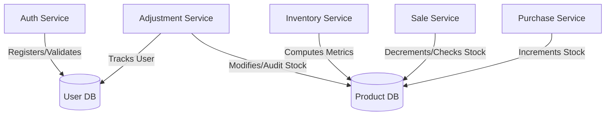

# GreenHarvest Inventory Management API

An enterprise-grade, high-performance inventory tracking and backend platform built using **Java 17**, **Spring Boot 3.x**, and **Spring Security**. The architecture optimizes data throughput by serving raw, high-density JSON data structures straight to client frontends without bulky envelope wrapper bloat, while offloading strict data validation tasks entirely into transaction service bounds.

---

## 🛠️ Key Architectural Highlights

* **Raw JSON Data Deliveries:** Bypasses conventional envelope response objects (`success`, `message`, `timestamp`). Successful endpoint executions return raw DTO records or arrays directly, drastically dropping processing overhead.
* **Service-Bounded Validations:** Completely avoids heavy Jakarta (`@Valid` / `@NotNull`) annotations on controllers or payload records. Data constraints are hand-checked immediately at the service layer threshold before running database logic.
* **Active Directory Style RBAC:** Fine-grained authorization structures using method-level `@PreAuthorize` strings tracking dedicated operational tasks across administrators, warehouse operators, and sales reps.
* **Account Lockout Protection:** Automatically locks user accounts for **5 minutes** after **5 consecutive failed login attempts** to prevent brute-force attacks.
* **Admin-Seeded User Provisioning:** Restricts user creation strictly to `ADMINISTRATOR` accounts while automatically bootstrapping a primary Admin account on startup if none exists in the database.
* **Secure Token Lifecycle:** Implements JWT access states coupled with a server-side Redis or reactive database token blacklisting infrastructure to handle secure logouts and immediate role invalidation.

---

## 📊 Domain Layout Diagram



---

## 🔐 REST API Endpoints & RBAC Security Matrix

### 🔑 Authentication & User Provisioning (`/api/auth`)

| HTTP Method | URI Path | Required Authority / Access | Payload (Body) | Explicit Success Return |
| --- | --- | --- | --- | --- |
| **POST** | `/api/auth/login` | Public | `LoginRequest` | Raw `LoginResponse` with JWT |
| **POST** | `/api/auth/register` | `ADMINISTRATOR` | `RegisterRequest` | Raw `UserResponse` object |
| **POST** | `/api/auth/logout` | `isAuthenticated()` | None *(Bearer Header)* | `204 No Content` |

> **Security Rules:**
> * **Account Lockout:** 5 failed logins lock the account for 5 minutes (`400 Bad Request` or `423 Locked`).
> * **User Management:** Only authenticated `ADMINISTRATOR` accounts can register new users.
>
>

---

### 📦 Product Catalog (`/api/products`)

| HTTP Method | URI Path | Required Authority | Explicit Success Return |
| --- | --- | --- | --- |
| **GET** | `/api/products` | `isAuthenticated()` | `List<ProductResponse>` |
| **GET** | `/api/products/{id}` | `isAuthenticated()` | Single `ProductResponse` object |
| **POST** | `/api/products` | `ADMINISTRATOR`, `WAREHOUSE_OFFICER` | `ProductResponse` (Created) |
| **PUT** | `/api/products/{id}` | `ADMINISTRATOR`, `WAREHOUSE_OFFICER` | `ProductResponse` (Updated) |
| **DELETE** | `/api/products/{id}` | `ADMINISTRATOR` | `204 No Content` |

---

### 🏬 Supplier Records (`/api/suppliers`)

| HTTP Method | URI Path | Required Authority | Explicit Success Return |
| --- | --- | --- | --- |
| **GET** | `/api/suppliers` | `isAuthenticated()` | `List<SupplierResponse>` |
| **GET** | `/api/suppliers/{id}` | `isAuthenticated()` | Single `SupplierResponse` |
| **POST** | `/api/suppliers` | `ADMINISTRATOR`, `WAREHOUSE_OFFICER` | `SupplierResponse` |
| **PUT** | `/api/suppliers/{id}` | `ADMINISTRATOR`, `WAREHOUSE_OFFICER` | `SupplierResponse` |
| **PATCH** | `/api/suppliers/{id}/status` | `ADMINISTRATOR` | `SupplierResponse` |

---

### 📥 Inbound Purchases Ledger (`/api/purchases`)

| HTTP Method | URI Path | Required Authority | Explicit Success Return |
| --- | --- | --- | --- |
| **POST** | `/api/purchases` | `ADMINISTRATOR`, `WAREHOUSE_OFFICER` | `PurchaseResponse` *(Auto-calculates/adds stock)* |
| **GET** | `/api/purchases` | `ADMINISTRATOR`, `WAREHOUSE_OFFICER` | `List<PurchaseResponse>` |
| **GET** | `/api/purchases/{id}` | `ADMINISTRATOR`, `WAREHOUSE_OFFICER` | Single `PurchaseResponse` |

---

### 📤 Outbound Sales Ledger (`/api/sales`)

| HTTP Method | URI Path | Required Authority | Explicit Success Return |
| --- | --- | --- | --- |
| **POST** | `/api/sales` | `ADMINISTRATOR`, `SALES_OFFICER` | `SaleResponse` *(Validates limits & drops stock)* |
| **GET** | `/api/sales` | `ADMINISTRATOR`, `SALES_OFFICER` | `List<SaleResponse>` |
| **GET** | `/api/sales/{id}` | `ADMINISTRATOR`, `SALES_OFFICER` | Single `SaleResponse` |

---

### ⚖️ Inventory Adjustments Ledger (`/api/adjustments`)

*Handles non-transactional inventory adjustments (damages, expirations, customer returns, and physical audit corrections).*

| HTTP Method | URI Path | Required Authority | Explicit Success Return |
| --- | --- | --- | --- |
| **POST** | `/api/adjustments` | `ADMINISTRATOR`, `WAREHOUSE_OFFICER` | `InventoryAdjustmentResponse` |
| **GET** | `/api/adjustments` | `ADMINISTRATOR`, `WAREHOUSE_OFFICER` | `List<InventoryAdjustmentResponse>` |
| **GET** | `/api/adjustments/product/{productId}` | `ADMINISTRATOR`, `WAREHOUSE_OFFICER` | `List<InventoryAdjustmentResponse>` |

> **Adjustment Calculation Rules:**
> * **`DAMAGED` / `EXPIRED`:** Decrements current product stock.
> * **`RETURN`:** Increments current product stock.
> * **`MANUAL_CORRECTION`:** Applies a positive or negative quantity delta based on audit reconciliations.
> * **Negative Stock Protection:** Throws `ValidationException` if an adjustment would cause stock to drop below 0.
> * **Auditing:** Every entry records the associated `Product`, signed `Quantity`, `Reason`, `User` who executed the adjustment, and auto-generated timestamp.
>
>

---

### 📈 Real-Time Analytics Dashboard (`/api/inventory`)

| HTTP Method | URI Path | Required Authority | Explicit Success Return |
| --- | --- | --- | --- |
| **GET** | `/api/inventory/dashboard` | `ADMINISTRATOR`, `WAREHOUSE_OFFICER` | Raw `InventoryDashboardResponse` metrics |

---

## ⚡ Service Validation Conventions (Requirement 7)

By running data verification routines in pure Java, the code intercepts bad states before processing them:

* **SKUs (`ProductService`):** Enforces a rigid uppercase pattern matching standard `^GH-[A-Z]{3}-\d{3}$` (e.g., `GH-APP-001`).
* **Stocks / Prices:** Rejects any entries setting prices $\le 0$ or minimum threshold configurations $< 0$.
* **Warehouse Guards (`SaleService` & `InventoryAdjustmentService`):** Evaluates existing system metrics prior to executing transactions. If requested sales or adjustment deductions exceed available stock, execution halts immediately into a `ValidationException` or `InsufficientStockException`.

---

## 🚀 Local Run Environment Guide

### Core System Requirements

* **Java Development Kit (JDK) 17**
* **Maven 3.8+**
* **PostgreSQL / MySQL Server**

### Step 1: Configure Application Properties

Create or update your `application.yml` file under `src/main/resources/`:

```yaml
spring:
  datasource:
    url: jdbc:postgresql://localhost:5432/greenharvest
    username: your_db_username
    password: your_db_password
  jpa:
    hibernate:
      ddl-auto: update
    show-sql: false

app:
  jwt:
    secret: your_super_secure_unbreakable_jwt_base64_secret_key_string_here
    expiration-ms: 86400000 # 24 Hours
  admin:
    full-name: "Maxwell Mwaura"
    email: "maxwell@greenharvest.com"
    password: "SecurePassword123"

```

### Step 2: Compile & Build Execution

Execute clean lifecycle tracking targets from your terminal:

```bash
mvn clean package

```

### Step 3: Run the Application Instance

Fire up the executable application package:

```bash
java -jar target/greenharvest-inventory-0.0.1-SNAPSHOT.jar

```

The application server instance initializes on port `8080`. On first run, `AdminSeeder` automatically creates the default `ADMINISTRATOR` user (`maxwell@greenharvest.com`).

```

```