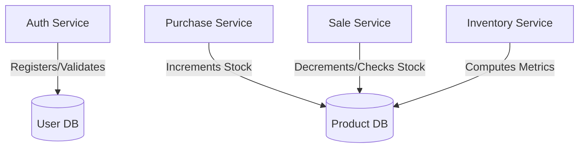

# GreenHarvest Inventory Management API

An enterprise-grade, high-performance inventory tracking and backend platform built using **Java 17**, **Spring Boot 3.x**, and **Spring Security**. The architecture optimizes data throughput by serving raw, high-density JSON data structures straight to client frontends without bulky envelope wrapper bloat, while offloading strict data validation tasks entirely into transaction service bounds.

---

##  Key Architectural Highlights

* **Raw JSON Data Deliveries:** Bypasses conventional envelope response objects (`success`, `message`, `timestamp`). Successful endpoint executions return raw DTO records or arrays directly, drastically dropping processing overhead.
* **Service-Bounded Validations:** Completely avoids heavy Jakarta (`@Valid` / `@NotNull`) annotations on controllers or payload records. Data constraints are hand-checked immediately at the service layer threshold before running database logic.
* **Active Directory Style RBAC:** Fine-grained authorization structures using method-level `@PreAuthorize` strings tracking dedicated operational tasks across administrators, warehouse operators, and sales reps.
* **Secure Token Lifecycle:** Implements JWT access states coupled with a server-side Redis or reactive database token blacklisting infrastructure to handle secure logouts and immediate role invalidation.

---

##  Domain Layout Diagram



---

##  REST API Endpoints & RBAC Security matrix

###  Authentication Module (`/api/auth`)

*Public endpoints accessible without tokens.*

| HTTP Method | URI Path | Payload (Body) | Explicit Success Return |
| --- | --- | --- | --- |
| **POST** | `/api/auth/register` | `RegisterRequest` | Raw `UserResponse` object |
| **POST** | `/api/auth/login` | `LoginRequest` | Raw `LoginResponse` object with JWT Token |
| **POST** | `/api/auth/logout` | None *(Bearer header required)* | `204 No Content` |

###  Product Catalog (`/api/products`)

| HTTP Method | URI Path | Required Authority | Explicit Success Return |
| --- | --- | --- | --- |
| **GET** | `/api/products` | `isAuthenticated()` | `List<ProductResponse>` |
| **GET** | `/api/products/{id}` | `isAuthenticated()` | Single `ProductResponse` object |
| **POST** | `/api/products` | `ROLE_ADMINISTRATOR`, `ROLE_WAREHOUSE_OFFICER` | `ProductResponse` (Created) |
| **PUT** | `/api/products/{id}` | `ROLE_ADMINISTRATOR`, `ROLE_WAREHOUSE_OFFICER` | `ProductResponse` (Updated) |
| **DELETE** | `/api/products/{id}` | `ROLE_ADMINISTRATOR` | `204 No Content` |

###  Supplier Records (`/api/suppliers`)

| HTTP Method | URI Path | Required Authority | Explicit Success Return |
| --- | --- | --- | --- |
| **GET** | `/api/suppliers` | `isAuthenticated()` | `List<SupplierResponse>` |
| **GET** | `/api/suppliers/{id}` | `isAuthenticated()` | Single `SupplierResponse` |
| **POST** | `/api/suppliers` | `ROLE_ADMINISTRATOR`, `ROLE_WAREHOUSE_OFFICER` | `SupplierResponse` |
| **PUT** | `/api/suppliers/{id}` | `ROLE_ADMINISTRATOR`, `ROLE_WAREHOUSE_OFFICER` | `SupplierResponse` |
| **PATCH** | `/api/suppliers/{id}/status` | `ROLE_ADMINISTRATOR` | `SupplierResponse` |

###  Inbound Purchases Ledger (`/api/purchases`)

| HTTP Method | URI Path | Required Authority | Explicit Success Return |
| --- | --- | --- | --- |
| **POST** | `/api/purchases` | `ROLE_ADMINISTRATOR`, `ROLE_WAREHOUSE_OFFICER` | `PurchaseResponse` *(Auto-calculates/adds stock)* |
| **GET** | `/api/purchases` | `ROLE_ADMINISTRATOR`, `ROLE_WAREHOUSE_OFFICER` | `List<PurchaseResponse>` |
| **GET** | `/api/purchases/{id}` | `ROLE_ADMINISTRATOR`, `ROLE_WAREHOUSE_OFFICER` | Single `PurchaseResponse` |

###  Outbound Sales Ledger (`/api/sales`)

| HTTP Method | URI Path | Required Authority | Explicit Success Return |
| --- | --- | --- | --- |
| **POST** | `/api/sales` | `ROLE_ADMINISTRATOR`, `ROLE_SALES_OFFICER` | `SaleResponse` *(Validates limits & drops stock)* |
| **GET** | `/api/sales` | `ROLE_ADMINISTRATOR`, `ROLE_SALES_OFFICER` | `List<SaleResponse>` |
| **GET** | `/api/sales/{id}` | `ROLE_ADMINISTRATOR`, `ROLE_SALES_OFFICER` | Single `SaleResponse` |

###  Real-Time Analytics Dashboard (`/api/inventory`)

| HTTP Method | URI Path | Required Authority | Explicit Success Return |
| --- | --- | --- | --- |
| **GET** | `/api/inventory/dashboard` | `ROLE_ADMINISTRATOR`, `ROLE_WAREHOUSE_OFFICER` | Raw `InventoryDashboardResponse` metrics |

---

##  Service Validation Conventions (Requirement 7)

By running data verification routines in pure Java, the code intercepts bad states before processing them:

* **SKUs (`ProductService`):** Enforces a rigid uppercase pattern matching standard `^GH-[A-Z]{3}-\d{3}$` (e.g., `GH-APP-001`).
* **Stocks / Prices:** Rejects any entries setting prices $\le 0$ or minimum threshold configurations $< 0$.
* **Warehouse Guards (`SaleService`):** Evaluates existing system metrics prior to compiling checkout manifests. If requested counts exceed current availability, it drops execution out immediately into a clean `InsufficientStockException`.

---

##  Local Run Environment Guide

### Core System Requirements

* **Java Development Kit (JDK) 17**
* **Maven 3.8+**
* **PostgreSQL / MySQL Server**

### Step 1: Clone and Configure Environment Variables

Create an `application.yml` file under `src/main/resources/` mapping your credentials:

```yaml
spring:
  datasource:
    url: jdbc:postgresql://localhost:5432/greenharvest
    username: your_db_username
    password: your_db_password
  jpa:
    hibernate:
      ddl-auto: update
    show-sql: false

app:
  jwt:
    secret: your_super_secure_unbreakable_jwt_base64_secret_key_string_here
    expiration-ms: 86400000 # 24 Hours

```

### Step 2: Compile & Packaging Execution

Execute clean lifecycle tracking targets from your shell terminal:

```bash
mvn clean package

```

### Step 3: Run the Application Instance

Fire up the local executable target package layer:

```bash
java -jar target/greenharvest-inventory-0.0.1-SNAPSHOT.jar

```

The application server instances will initialize on port `8080` via standard execution properties.